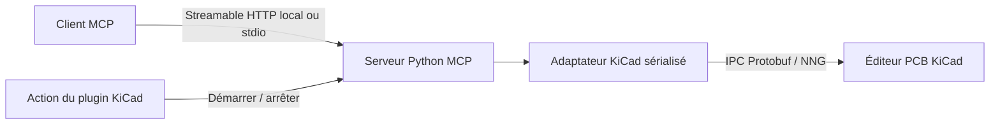

# KiCad MCP — HackInvent

[](https://github.com/HackInvent/kicad-mcp/actions/workflows/ci.yml)

Un plugin **KiCad 10+** qui démarre un serveur [Model Context Protocol](https://modelcontextprotocol.io/) pour travailler sur le PCB ouvert depuis un assistant compatible MCP.

Le plugin utilise l’API IPC officielle de KiCad et la bibliothèque `kicad-python`, sans bindings `pcbnew`/SWIG. Il propose deux actions : **Start MCP server** et **Stop MCP server**. Un mode **stdio** permet aussi au client MCP de lancer directement le serveur.

**Version 0.1.0, alpha.** Le protocole MCP, le cycle de vie du serveur et les opérations sont testés automatiquement. Les tests KiCad utilisent les vrais objets de `kicad-python` avec un éditeur simulé ; le contrôle dans une véritable interface KiCad reste à effectuer. Le projet concerne l’éditeur PCB, avec une instance graphique ouverte.

## Outils disponibles

| Outil MCP | Fonction |
|---|---|
| `kicad_status` | Vérifier la connexion et la version de KiCad |
| `get_board_info` | Lire le nom de la carte, ses couches et ses nombres d’objets |
| `list_footprints` | Lire références, valeurs, positions, rotations et verrouillage ; filtre exact facultatif |
| `list_nets` | Lister les réseaux électriques |
| `list_tracks` | Lire les pistes droites et courbes, leurs dimensions et leurs réseaux |
| `get_selection` | Lire les objets sélectionnés dans l’éditeur |
| `move_footprint` | Déplacer un composant par sa référence et éventuellement le tourner |
| `add_track` | Ajouter une piste droite sur une couche cuivre active |
| `add_text` | Ajouter du texte sur la carte |
| `save_board` | Sauvegarder explicitement le PCB dans son fichier actuel |

Les distances sont en **millimètres**, les positions sont absolues et les angles en **degrés**. Les modifications créent une étape d’annulation dans KiCad. Elles ne déclenchent aucune sauvegarde automatique. `save_board` enregistre aussi les autres changements non sauvegardés présents dans l’éditeur.

`add_track` crée un segment ; il ne fait ni routage automatique, ni contrôle des règles électriques. Un composant verrouillé ou une référence ambiguë est refusé. Les empreintes contenant des éléments que `kicad-python` ne peut pas transformer correctement sont également refusées ; les pastilles, la géométrie standard et les modèles 3D sont pris en charge.

## Installer dans KiCad

Prérequis : KiCad 10.0 ou plus récent, Python 3.10+ et son support `venv`/`pip`, ainsi qu’un accès réseau lors de la première préparation des dépendances. Sur Debian/Ubuntu, le paquet `python3-venv` peut être nécessaire.

### Avec le gestionnaire de plugins

1. Télécharger `hackinvent-kicad-mcp-0.1.0.zip` depuis les [versions publiées](https://github.com/HackInvent/kicad-mcp/releases).
2. Dans le gestionnaire de projets KiCad, ouvrir **Plugin and Content Manager**, puis **Install from File** et choisir ce ZIP.
3. Activer l’API KiCad dans les préférences de plugins, puis ouvrir un PCB et recharger les plugins ou redémarrer l’éditeur.
4. Attendre la création de l’environnement Python du plugin, puis lancer **Start MCP server**.

Le paquet n’est pas encore référencé dans le catalogue officiel KiCad. Il s’installe depuis le fichier ZIP.

### Depuis le dépôt

```bash
git clone https://github.com/HackInvent/kicad-mcp.git
cd kicad-mcp
python3 scripts/install_plugin.py --version 10.0
```

L’installateur copie le plugin dans le répertoire utilisateur KiCad. Il ne modifie pas les fichiers de programme. Les chemins habituels sont :

- Linux : `~/.local/share/KiCad/10.0/plugins/org.hackinvent.kicad-mcp`
- macOS : `~/Documents/KiCad/10.0/plugins/org.hackinvent.kicad-mcp`
- Windows : `%USERPROFILE%\Documents\KiCad\10.0\plugins\org.hackinvent.kicad-mcp`

`--destination /chemin/exact/du/plugin` permet de choisir un autre emplacement, notamment si Documents est redirigé. Pour mettre à jour cette installation, ajouter `--overwrite` ; l’installateur vérifie d’abord l’identifiant du plugin existant. Éviter d’installer simultanément le ZIP et une copie manuelle du même plugin.

Sur Windows, utiliser `py` ou `python` à la place de `python3` selon l’installation.

## Connecter un client MCP en HTTP

Après **Start MCP server**, le serveur écoute par défaut sur :

```text
http://127.0.0.1:8765/mcp
```

Un jeton propre au serveur protège toutes ses routes. Depuis le dépôt, récupérer les paramètres des serveurs actifs :

```bash
python3 scripts/connection_info.py
```

Cette commande utilise uniquement la bibliothèque standard Python. Elle affiche les champs `url` et `token` à fournir au client :

```text
Transport : Streamable HTTP
URL       : http://127.0.0.1:8765/mcp
En-tête   : Authorization: Bearer <valeur du champ token>
```

Le format de configuration dépend du client. Il doit permettre de définir cet en-tête HTTP. L’authentification est un jeton local partagé, sans serveur OAuth ; un client qui impose OAuth ne peut pas utiliser ce mode directement. Les clients navigateur qui envoient un en-tête `Origin` sont refusés ; utiliser un client MCP natif ou le mode stdio.

Le jeton est renouvelé à chaque démarrage, sauf si `KICAD_MCP_TOKEN` est défini. Il est distinct du jeton IPC interne de KiCad. Ne pas inclure ces valeurs dans les issues ou les commits.

Sans copie du dépôt, les informations de connexion sont aussi dans un fichier JSON de session :

| Système | Répertoire des sessions |
|---|---|
| Linux | `$XDG_STATE_HOME/kicad-mcp`, sinon `~/.local/state/kicad-mcp` |
| macOS | `~/Library/Application Support/kicad-mcp` |
| Windows | `%LOCALAPPDATA%\kicad-mcp` |

Les fichiers contiennent un secret ; les permissions POSIX sont limitées à leur propriétaire. **Stop MCP server** arrête le serveur associé à l’instance KiCad qui lance l’action. Les verrous de session empêchent deux démarrages concurrents pour la même instance.

## Mode stdio et développement

```bash
python3 -m venv .venv
.venv/bin/python -m pip install -e '.[dev]'
.venv/bin/kicad-mcp serve --transport stdio
```

Sous Windows, les exécutables de l’environnement sont dans `.venv\Scripts\`.

Pour un client qui accepte le format `mcpServers`, adapter les chemins de cet exemple :

```json
{
  "mcpServers": {
    "kicad": {
      "command": "/CHEMIN/ABSOLU/kicad-mcp/.venv/bin/python",
      "args": ["-m", "kicad_mcp", "serve", "--transport", "stdio"]
    }
  }
}
```

Dans ce mode, le client MCP gère la durée de vie du serveur : il n’est pas nécessaire de cliquer sur **Start MCP server**. L’éditeur KiCad doit rester ouvert et son API activée. Avec une seule instance, `kicad-python` cherche le socket KiCad par défaut. Utiliser `--socket` ou `KICAD_API_SOCKET` pour cibler une autre instance. Après un redémarrage de KiCad, relancer le serveur pour reprendre la bonne session.

Autres commandes, après installation Python :

```bash
kicad-mcp serve --transport streamable-http --port 8765
kicad-mcp serve --transport stdio --read-only
kicad-mcp status
kicad-mcp status --show-token
kicad-mcp stop
```

`--read-only` retire les quatre outils d’écriture et bloque aussi les mutations au niveau de l’adaptateur KiCad. `status` masque le jeton par défaut. En présence de plusieurs serveurs, `stop --socket /chemin/du/socket` sélectionne l’instance à arrêter.

### Configuration du lancement depuis KiCad

Définir ces variables **avant de lancer KiCad** :

| Variable | Effet |
|---|---|
| `KICAD_MCP_PORT` | Port HTTP, `8765` par défaut ; `0` choisit un port libre |
| `KICAD_MCP_TOKEN` | Jeton HTTP fixe facultatif pour garder la configuration du client |
| `KICAD_MCP_READ_ONLY=1` | Activer la lecture seule |
| `KICAD_MCP_STATE_DIR` | Déplacer le répertoire des sessions |

KiCad transmet automatiquement `KICAD_API_SOCKET` et `KICAD_API_TOKEN` aux actions du plugin. Pour plusieurs instances simultanées, utiliser des ports différents ou `KICAD_MCP_PORT=0`, puis lire les URL avec `connection_info.py`.

## Vérification

```bash
.venv/bin/ruff check .
.venv/bin/python -m pytest -q
.venv/bin/python -m build
python3 scripts/build_plugin.py
```

La CI effectue ces contrôles sous Python 3.10, 3.12 et 3.13. Les tests couvrent les vrais clients MCP HTTP/stdio, les erreurs, les restrictions d’accès, les démarrages répétés, l’arrêt, les unités KiCad, le retour arrière des transactions et les archives PCM. Ils ne nécessitent pas une interface KiCad.

Pour le contrôle manuel sur une **copie d’un PCB de test** :

1. Installer le plugin et démarrer le serveur depuis KiCad.
2. Connecter un client, appeler `kicad_status`, `get_board_info` et `list_footprints`.
3. Déplacer un composant déverrouillé et vérifier ses coordonnées, puis annuler dans KiCad.
4. Ajouter un texte et une piste sur des couches actives ; vérifier le résultat et le DRC dans l’éditeur.
5. Appeler `save_board` seulement si le résultat est attendu.
6. Arrêter le serveur avec l’action KiCad et vérifier que le client se déconnecte.

Si le plugin n’apparaît pas, vérifier l’environnement Python et les messages de KiCad. Si le serveur indique qu’il ne peut pas se connecter, vérifier l’API activée, le PCB ouvert et le socket sélectionné. Si le port est occupé, choisir un autre `KICAD_MCP_PORT`.

## Architecture et références



- `src/kicad_mcp/server.py` : outils MCP et authentification HTTP.
- `src/kicad_mcp/bridge.py` : accès IPC, conversions et transactions d’édition.
- `src/kicad_mcp/__main__.py` : transports, sessions et commandes de contrôle.
- `plugin/` : manifeste IPC, dépendances et actions KiCad.
- `scripts/` : installation locale, informations de connexion et archive PCM.

Sources officielles utilisées : [API IPC KiCad](https://dev-docs.kicad.org/en/apis-and-binding/ipc-api/for-addon-developers/), [bibliothèque kicad-python](https://gitlab.com/kicad/code/kicad-python), [format des paquets KiCad](https://dev-docs.kicad.org/en/addons/), [SDK MCP Python, branche 1.x](https://github.com/modelcontextprotocol/python-sdk/tree/v1.x).

Licence [MIT](LICENSE).
