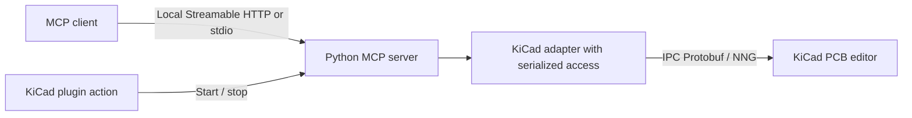

# KiCad MCP — HackInvent

[](https://github.com/HackInvent/kicad-mcp/actions/workflows/ci.yml)

A **KiCad 10+** plugin that starts a [Model Context Protocol](https://modelcontextprotocol.io/) server, letting MCP-compatible assistants work with the open PCB.

The plugin uses KiCad’s official IPC API and the `kicad-python` library, without `pcbnew`/SWIG bindings. It provides two actions: **Start MCP server** and **Stop MCP server**. A **stdio** mode also lets an MCP client launch the server directly.

**Version 0.2.0, alpha.** The MCP protocol, server lifecycle and operations are covered by automated tests. The KiCad tests use real `kicad-python` objects with a simulated editor; validation in a real KiCad interface is still pending. This project targets the PCB editor and requires a running GUI instance.

## Available tools

| MCP tool | Function |
|---|---|
| `kicad_status` | Check the connection and KiCad version |
| `get_board_info` | Read the board name, layers and item counts |
| `list_footprints` | Read references, values, positions, rotations and lock status; optional exact reference filter |
| `list_nets` | List electrical nets |
| `list_tracks` | Read straight and curved tracks, their dimensions and nets |
| `get_selection` | Read the items selected in the editor |
| `get_bom` | Read a grouped or individual-component BOM from the open PCB |
| `export_bom` | Return the PCB BOM as CSV text to the MCP client |
| `move_footprint` | Move a component by its reference and optionally rotate it |
| `add_track` | Add a straight track on an enabled copper layer |
| `add_text` | Add text to the board |
| `update_bom_fields` | Update component values, custom BOM fields and assembly flags |
| `save_board` | Explicitly save the PCB to its current file |

There are **13 tools: eight read tools and five write tools**. BOM export reads the PCB and returns text; it does not write a file.

Distances are in **millimetres**, positions are absolute and angles are in **degrees**. Edits create an undo step in KiCad. They never trigger an automatic save. `save_board` also saves any other unsaved changes currently in the editor.

`add_track` creates a segment; it does not perform autorouting or design-rule checks. Locked components and ambiguous references are rejected. Footprints containing items that `kicad-python` cannot safely transform are also rejected; pads, standard geometry and 3D models are supported.

## Work with a bill of materials

The BOM is derived from the **open PCB**, including its current unsaved changes. It uses footprint values, library identifiers, custom fields and assembly flags available through KiCad’s PCB API. It does not read the schematic or resolve assembly variants.

`get_bom` and `export_bom` share these options:

| Argument | Default | Behavior |
|---|---|---|
| `grouped` | `true` | Combine matching components into rows with references and a quantity per board; use `false` for one component per row |
| `include_dnp` | `false` | Include components marked “Do not populate” when enabled |
| `include_excluded` | `false` | Include components marked “Exclude from BOM” when enabled |
| `fields` | `null` | Include all custom fields; provide a list to select particular custom fields |

Grouping compares values, complete library footprint identifiers and custom metadata, including manufacturer part numbers. Selecting fewer output fields does not merge components with different MPNs or other hidden metadata. References use natural ordering, such as `R2` before `R10`. Quantities describe one copy of the board. Included components must have unique, annotated references; ambiguous or unannotated references produce an actionable error. Requested custom fields that are absent from a component are returned as empty strings.

A typical workflow is to inspect the BOM, update selected components, export it, and explicitly save the board if you want to keep the edits.

1. Call `get_bom` with these MCP arguments to inspect purchasing fields:

```json
{
  "grouped": true,
  "include_dnp": false,
  "include_excluded": false,
  "fields": ["Manufacturer", "MPN"]
}
```

2. Call `update_bom_fields` to set the value, custom fields and assembly flags for selected references:

```json
{
  "references": ["R1", "R2"],
  "value": "10k",
  "fields": {
    "Manufacturer": "Example Components",
    "MPN": "EXAMPLE-10K-0603"
  },
  "dnp": false,
  "exclude_from_bom": false
}
```

Provide `references` and at least one change; omit options you do not want to change. Use `value` for the built-in component value and `fields` to add or edit custom metadata such as Manufacturer or MPN. The update uses a single undoable transaction and does not save the board. It is unavailable in read-only mode. Use an empty string to clear a custom field’s value. Reapplying identical values makes no changes and returns `updated_count: 0`.

3. Call `export_bom` with these arguments to retrieve CSV text:

```json
{
  "grouped": true,
  "fields": ["Manufacturer", "MPN"],
  "delimiter": ","
}
```

The MCP response contains `csv`, a suggested `filename`, `mime_type`, `row_count` and `component_count` for your client to display or save. Choose comma (`","`), semicolon (`";"`) or tab (`"\t"`) as the delimiter. The server does not create a CSV file on disk. CSV quoting handles commas, newlines and Unicode; spreadsheet formula prefixes are escaped to prevent them from being evaluated as formulas. Custom column names that would collide with another CSV header are prefixed with `Field:`; the original names remain unchanged in `get_bom`.

4. Inspect the board and call `save_board` with `{}` only when you want to save the result. This also saves any other pending PCB changes. You can undo the metadata update in KiCad before saving.

BOM updates modify **PCB footprint data only**. They do not edit or back-annotate the schematic. A later **Update PCB from Schematic** may overwrite these fields, so maintain the corresponding schematic metadata separately when it is the source of truth.

## Install in KiCad

Requirements: KiCad 10.0 or later, Python 3.10+ with `venv`/`pip` support, and network access when dependencies are first installed. On Debian/Ubuntu, you may need the `python3-venv` package.

### Using the Plugin and Content Manager

1. Download `hackinvent-kicad-mcp-0.2.0.zip` from the [releases page](https://github.com/HackInvent/kicad-mcp/releases).
2. In the KiCad project manager, open **Plugin and Content Manager**, choose **Install from File** and select the ZIP.
3. Enable the KiCad API in the plugin preferences, then open a PCB and reload the plugins or restart the editor.
4. Wait for the plugin’s Python environment to be created, then run **Start MCP server**.

The package is not yet listed in KiCad’s official plugin catalogue. Install it from the ZIP file.

### From the repository

```bash
git clone https://github.com/HackInvent/kicad-mcp.git
cd kicad-mcp
python3 scripts/install_plugin.py --version 10.0
```

The installer copies the plugin into KiCad’s user directory. It does not modify KiCad’s program files. Typical paths are:

- Linux: `~/.local/share/KiCad/10.0/plugins/org.hackinvent.kicad-mcp`
- macOS: `~/Documents/KiCad/10.0/plugins/org.hackinvent.kicad-mcp`
- Windows: `%USERPROFILE%\Documents\KiCad\10.0\plugins\org.hackinvent.kicad-mcp`

Use `--destination /exact/path/to/plugin` to choose another location, for example when your Documents folder is redirected. To update this installation, add `--overwrite`; the installer first checks the existing plugin’s identifier. Avoid installing both the ZIP and a manual copy of the same plugin.

On Windows, use `py` or `python` instead of `python3`, depending on your installation.

## Connect an MCP client over HTTP

After running **Start MCP server**, the server listens at this address by default:

```text
http://127.0.0.1:8765/mcp
```

A server-specific token protects every route. From the repository, retrieve the connection settings for running servers:

```bash
python3 scripts/connection_info.py
```

This command uses only the Python standard library. It displays the `url` and `token` fields to provide to your client:

```text
Transport : Streamable HTTP
URL       : http://127.0.0.1:8765/mcp
Header    : Authorization: Bearer <value of the token field>
```

The configuration format depends on your client. It must support setting this HTTP header. Authentication uses a shared local token, without an OAuth server; clients that require OAuth cannot use this mode directly. Browser clients that send an `Origin` header are rejected; use a native MCP client or stdio mode.

The token changes on each startup unless `KICAD_MCP_TOKEN` is set. It is separate from KiCad’s internal IPC token. Do not include either token in issues or commits.

Without a copy of the repository, you can also find the connection settings in a session JSON file:

| System | Session directory |
|---|---|
| Linux | `$XDG_STATE_HOME/kicad-mcp`, or `~/.local/state/kicad-mcp` if unset |
| macOS | `~/Library/Application Support/kicad-mcp` |
| Windows | `%LOCALAPPDATA%\kicad-mcp` |

These files contain a secret; POSIX permissions restrict access to their owner. **Stop MCP server** stops the server associated with the KiCad instance that launches the action. Session locks prevent concurrent startups for the same instance.

## Stdio mode and development

```bash
python3 -m venv .venv
.venv/bin/python -m pip install -e '.[dev]'
.venv/bin/kicad-mcp serve --transport stdio
```

On Windows, the environment’s executables are in `.venv\Scripts\`.

For a client that accepts the `mcpServers` format, adapt the paths in this example:

```json
{
  "mcpServers": {
    "kicad": {
      "command": "/ABSOLUTE/PATH/kicad-mcp/.venv/bin/python",
      "args": ["-m", "kicad_mcp", "serve", "--transport", "stdio"]
    }
  }
}
```

In this mode, the MCP client manages the server’s lifecycle; you do not need to click **Start MCP server**. The KiCad editor must remain open with its API enabled. With a single instance, `kicad-python` looks for the default KiCad socket. Use `--socket` or `KICAD_API_SOCKET` to target another instance. After restarting KiCad, restart the server to connect to the correct session.

Additional commands after installing the Python package:

```bash
kicad-mcp serve --transport streamable-http --port 8765
kicad-mcp serve --transport stdio --read-only
kicad-mcp status
kicad-mcp status --show-token
kicad-mcp stop
```

`--read-only` removes the five write tools, including `update_bom_fields`, and also blocks mutations in the KiCad adapter. `status` hides the token by default. When multiple servers are running, use `stop --socket /path/to/socket` to select the instance to stop.

### Configure startup from KiCad

Set these variables **before starting KiCad**:

| Variable | Effect |
|---|---|
| `KICAD_MCP_PORT` | HTTP port, `8765` by default; `0` selects an available port |
| `KICAD_MCP_TOKEN` | Optional fixed HTTP token to keep the client configuration unchanged |
| `KICAD_MCP_READ_ONLY=1` | Enable read-only mode |
| `KICAD_MCP_STATE_DIR` | Override the session directory |

KiCad automatically passes `KICAD_API_SOCKET` and `KICAD_API_TOKEN` to plugin actions. For multiple simultaneous instances, use different ports or `KICAD_MCP_PORT=0`, then retrieve their URLs with `connection_info.py`.

## Verification

```bash
.venv/bin/ruff check .
.venv/bin/python -m pytest -q
.venv/bin/python -m build
python3 scripts/build_plugin.py
```

CI runs these checks on Python 3.10, 3.12 and 3.13. Tests cover real HTTP/stdio MCP clients, errors, access restrictions, repeated startups, shutdown, KiCad units, transaction rollback, BOM grouping and CSV export, metadata updates, and PCM archives. They do not require a KiCad GUI.

For a manual check on a **copy of a test PCB**:

1. Install the plugin and start the server from KiCad.
2. Connect a client and call `kicad_status`, `get_board_info` and `list_footprints`.
3. Move an unlocked component and check its coordinates, then undo the change in KiCad.
4. Add text and a track on enabled layers; inspect the result and run DRC in the editor.
5. Read a BOM, update Manufacturer/MPN on test components, export the CSV and verify grouping, quantities and DNP filtering. Undo the metadata update in KiCad.
6. Call `save_board` only if the result is as expected.
7. Stop the server using the KiCad action and confirm that the client disconnects.

If the plugin does not appear, check the Python environment and KiCad’s messages. If the server cannot connect, check that the API is enabled, a PCB is open and the correct socket is selected. If the port is occupied, choose another `KICAD_MCP_PORT`.

## Architecture and references



- `src/kicad_mcp/server.py`: MCP tools and HTTP authentication.
- `src/kicad_mcp/bridge.py`: IPC access, conversions and edit transactions.
- `src/kicad_mcp/__main__.py`: transports, sessions and control commands.
- `plugin/`: IPC manifest, dependencies and KiCad actions.
- `scripts/`: local installation, connection settings and PCM packaging.

Official references: [KiCad IPC API](https://dev-docs.kicad.org/en/apis-and-binding/ipc-api/for-addon-developers/), [kicad-python library](https://gitlab.com/kicad/code/kicad-python), [KiCad package format](https://dev-docs.kicad.org/en/addons/), [MCP Python SDK, 1.x branch](https://github.com/modelcontextprotocol/python-sdk/tree/v1.x).

See [CHANGELOG.md](CHANGELOG.md) for release history.

[MIT](LICENSE) license.
